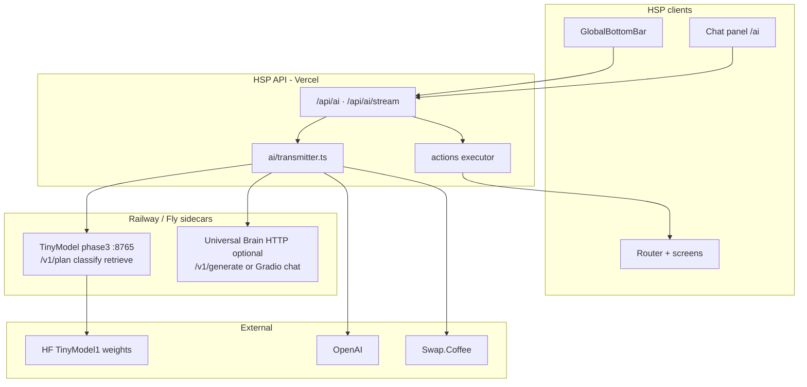

# Architecture: hybrid universal chat + control plane

## Layered stack



---

## Two TinyModel surfaces (do not confuse)

| Surface | Script / deploy | API | Use in HSP |
| ------- | ----------------- | --- | ---------- |
| **Encoder sidecar** | `phase3_reference_server.py` | JSON `POST /v1/plan` | **Primary** — routing, RAG, `actions[]`, `explain_screen` |
| **Universal Brain** | `universal_brain_chat.py` / Space artifact | Gradio `/chat` or `horizon2_server` | **Optional** — summarize, reformulate, full chat stack |

**Production recommendation:** Railway hosts **phase3 sidecar** first; add **UB service** when you want UB-native commands without OpenAI.

---

## Single turn (hybrid path)

```text
1. Client → POST /api/ai
     { input, context: { route, locale, walletConnected }, threadContext }

2. transmitter.ts (AI_PROVIDER=hybrid)
     a. planRequest(input, { context })  →  TINYMODEL_API_URL/v1/plan
     b. buildContext: thread + RAG chunk + NL overlays
     c. branch:
          - navigate / feature  → short reply + actions[]
          - token_info          → Swap.Coffee + OpenAI
          - explain_screen/chat → OpenAI (or UB_CHAT_URL) with RAG in system context

3. Response
     { ok, output_text, actions[], meta: { tinymodel, intent, … } }

4. Client
     - stream text into chat panel
     - apply actions[] (router.push, feature:shield, swap prefill)
```

---

## Request contract (HSP → API)

```json
{
  "input": "Open swap and explain slippage",
  "mode": "chat",
  "context": {
    "route": "/home",
    "locale": "en",
    "walletConnected": true,
    "selectedToken": "USDT"
  },
  "threadContext": { "messages": [] }
}
```

## Response contract (API → HSP)

```json
{
  "ok": true,
  "output_text": "Opening Swap. Slippage is the maximum price move you'll accept…",
  "actions": [{ "type": "navigate", "path": "/swap" }],
  "meta": {
    "intent": "navigate",
    "tinymodel": {
      "model": "HyperlinksSpace/TinyModel1",
      "route_hint": "navigate:/swap",
      "actions": [{ "type": "navigate", "path": "/swap" }],
      "routing": { "fallback": false, "label": "Business", "confidence": 0.55, "margin": 0.2, "reason": "accept" },
      "retrieval": null
    }
  }
}
```

Types and fetch helpers: [`integrations/hsp/reference/`](../integrations/hsp/reference/).

---

## Generation tier selection

| Profile | When | Provider |
| ------- | ---- | -------- |
| **fast** | Routing-only, short acks | TinyModel plan text template or SmolLM |
| **quality** | General chat, nuanced help | OpenAI (today) |
| **grounded** | Strict FAQ | RAG chunk in system prompt + OpenAI or UB |
| **token_info** | Symbol questions | Swap.Coffee facts + OpenAI |

Keep **OpenAI for wording** until self-hosted UB quality matches your bar on HSP eval sets.

---

## Why not HF Space API as primary?

| Topic | Public HF Space | Self-hosted (Railway) |
| ----- | --------------- | --------------------- |
| API shape | Gradio call/poll | Stable `/v1/plan` JSON |
| HSP corpus | Default FAQ | `hsp_program_corpus.md` bundled |
| `actions[]` | Not native | Built into `/v1/plan` |
| Cold start | 30–90s common | Your uptime SLA |
| Privacy | Shared demo | Your auth boundary |

Use HF Space to **prove** chat works; use Railway for **product**.
