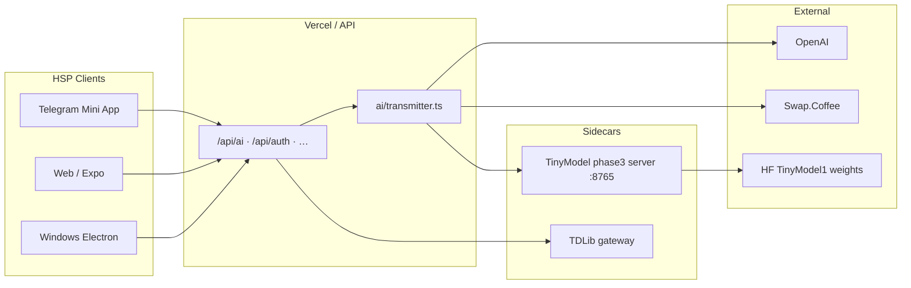

# Hyperlinks Space Program × TinyModel: development directions and integration plan

This note ties together **Hyperlinks Space Program** ([`HyperlinksSpaceProgram`](../../HyperlinksSpaceProgram)) and **TinyModel / Universal Brain** (this repo). It answers:

1. Where the **app** should go next (main development directions).
2. Which **high-frequency use cases** you can already cover—or cover better than generic chat rivals.
3. How to make the model **manage the HSP interface itself** (the bottom bar, navigation, and in-app actions).
4. **How to integrate** TinyModel into HSP in practice.

Related TinyModel docs: [`universal-brain-concept-vs-tinymodel-today.md`](universal-brain-concept-vs-tinymodel-today.md), [`universal-brain-forward-plan-self-development.md`](universal-brain-forward-plan-self-development.md), [`golden-prompts/README.md`](golden-prompts/README.md).

---

## 1. Two products, one stack

| Layer | Hyperlinks Space Program (today) | TinyModel (today) |
| ----- | -------------------------------- | ----------------- |
| **User surface** | Expo / TMA / Windows — wallet, swap, send, feed, auth, **GlobalBottomBar** (“AI & Search”) | Gradio **Universal Brain** Space — one chat box |
| **AI backend** | `ai/transmitter.ts` → **OpenAI** (`gpt-5.2`), modes `chat` \| `token_info`, Swap.Coffee facts | **TinyModel1** encoder + **SmolLM2** + FAQ RAG + NL routing + memory |
| **Persistence** | Neon (`database/messages.js`) thread history | SQLite memory (demo scopes) |
| **UI wiring** | Bottom bar → **`/ai?prompt=…`** (stub screen); bot uses full `transmitStream` | Full chat + tools + brain trace |

**Goal:** HSP stays the **product shell**; TinyModel becomes the **control-plane brain** inside it—routing user text to the right screen, tool, or answer—without forcing users to learn menus.

---

## 2. Main development directions (app roadmap)

Think in **four parallel tracks**. They reinforce each other; order is suggested, not rigid.

### Direction A — **AI-native shell (control plane)**

Make the **GlobalBottomBar** the primary way to operate the program—not a side feature.

| Milestone | What | Why |
| --------- | ---- | --- |
| A1 | Replace stub [`app/(app)/ai.tsx`](../../HyperlinksSpaceProgram/app/(app)/ai.tsx) with a **real chat panel** (inline on wide layout + full screen on narrow) | Backlog already lists “AI chat page”; bar already collects prompts |
| A2 | **Intent → action** map: chat, navigate, swap quote, token info, explain screen, settings | One input box; rivals still use separate search + support + docs |
| A3 | **Screen context** injected into every AI call (`route`, `locale`, `walletConnected`, `selectedToken`) | “Manage this interface” requires knowing where the user is |
| A4 | **Streaming** in app (mirror [`bot/responder.ts`](../../HyperlinksSpaceProgram/bot/responder.ts) `transmitStream`) | Parity with Telegram bot UX |

**TinyModel role:** JSON intent router + deterministic NL controls (`nl_controls.py`)—cheaper and more debuggable than asking GPT alone to pick tools.

---

### Direction B — **Domain intelligence (TON + program)**

HSP’s moat is **crypto + social + product**, not generic trivia.

| Milestone | What | Why |
| --------- | ---- | --- |
| B1 | Keep **Swap.Coffee–grounded** `token_info` (already in `transmitter.ts`) | Factual token answers; rivals lack TON-native grounding |
| B2 | Add **HSP FAQ RAG** (docs, `appStrings` help, swap/send flows) | Answers “how do I connect Telegram?”, “where is Shield?” from your corpus |
| B3 | **Feed / social** summarization and triage (messages, tasks, NFT events) | Matches backlog: “Analyse messages”, feed types |
| B4 | **Trade/swap assist**: explain rate, slippage, steps—not financial advice | High-frequency on swap/send/get routes |

**TinyModel role:** hybrid retrieval (`rag_faq_smoke` pattern) over a new corpus `texts/hsp_program_corpus.md`; encoder for similarity and routing. Stdlib gate: `python scripts/hsp_rag_smoke.py --verify` (12 golden queries). Encoder hybrid gate: `python scripts/hsp_rag_hybrid_smoke.py --verify` (torch + local checkpoint or Hub model).

---

### Direction C — **Platform & trust (ship everywhere)**

| Milestone | What | Why |
| --------- | ---- | --- |
| C1 | Auth completeness (GitHub, Google, Telegram, Apple per backlog) | AI must respect **logged-in scope** |
| C2 | Wallet + KMS path stable on all surfaces | AI actions that touch wallet need hard gates |
| C3 | i18n (en/ru today → zh backlog) + **reply language** from NL signals | UB already detects “answer in Spanish/Russian…” |
| C4 | Observability: token usage, route accuracy, failed tool calls | Feeds self-development loop |

---

### Direction D — **Self-improving assistant (closed loop)**

| Milestone | What | Why |
| --------- | ---- | --- |
| D1 | Golden prompts for **HSP intents** (extend [`golden-prompts/`](golden-prompts/)) | Regression before each release |
| D2 | Thumbs up/down → Horizon 11 JSONL → periodic review | [`universal-brain-forward-plan-self-development.md`](universal-brain-forward-plan-self-development.md) |
| D3 | Auto-promote routing/RAG patches when `ub_eval_runner --verify` stays ≥95% | “Develops by itself” with gates, not magic |

---

## 3. High-frequency use cases you can already cover (vs generic rivals)

These are **daily** tasks for your users. Generic ChatGPT/Copilot often can do them **in isolation**; your advantage is **one bar, in-app context, TON facts, and governed routing**.

### Already strong today (combine both repos)

| Use case | User says (examples) | HSP today | + TinyModel |
| -------- | -------------------- | --------- | ----------- |
| **Token lookup** | “What is USDT on TON?” | `token_info` + Swap.Coffee facts + GPT | Same facts; optional **encoder classify** for topic hint |
| **General chat** | “Explain gas on TON” | OpenAI chat + thread history | Add **FAQ excerpts** from program docs |
| **Premade prompts** | Bottom bar chips (tokens, artists, swap) | Routes to `/ai` stub | Route to **live chat** with `token_info` or swap intent |
| **Multilingual UI** | Russian UI + English question | `appStrings` locales | UB **language** / spelling NL signals on replies |
| **Telegram parity** | Same question in bot vs app | Bot streams via `transmitStream` | Unify provider layer so app = bot |

### Ready in TinyModel; not wired in HSP yet

| Use case | User says | Universal Brain capability | Rivals |
| -------- | --------- | -------------------------- | ------ |
| **Summarize** | “Summarize this agreement text…” | `/summarize`, smart route | Need copy-paste elsewhere |
| **Rephrase** | “Make this message professional” | `/reformulate` | Generic |
| **Step-by-step** | “How do I connect Telegram step by step” | embedded `step_style=numbered` | Inconsistent |
| **Brief vs detailed** | “Be brief” / session controls | `nl_controls` session + signals | Hidden settings |
| **Pros/cons / matrix** | “Compare wallet A vs B” | 40+ `prompt_signals` | Manual prompting |
| **Strict FAQ** | “Only use our docs” | FAQ grounding strict/relaxed | Hallucination-prone |
| **Remember preference** | “Remember my default slippage” | scoped memory | No product memory |
| **Navigate/help** | “What can this app do?” | `/help`, `/status` | No app map |

### HSP-specific intents to add (high ROI)

Map these in a new **`AiMode`** or **`intent`** field before calling generation:

| Intent | Example | Action |
| ------ | ------- | ------ |
| `navigate` | “Open swap” | `router.push('/swap')` |
| `navigate` | “Show my wallet” | `/get` |
| `token_info` | “$NOT price and holders” | existing Swap.Coffee path |
| `explain_screen` | “What is Shield?” | RAG over Shield docs + current route |
| `swap_intent` | “Swap 10 TON to ETH at current rate” | prefill swap UI (not auto-execute without confirm) |
| `support` | “Refund policy” | RAG + strict FAQ |
| `chat` | fallback | OpenAI or SmolLM tier |

**Competitive line:** rivals give **answers**; you give **answers + do the next click** inside one program.

---

## 4. “The model manages this interface”—what that means

Do **not** mean: the neural net directly clicks React Native views.

Do mean: a **text-in / text-out control plane** that:

1. **Understands** user text (intent + entities).
2. **Retrieves** program docs, token facts, and screen context.
3. **Decides** among: reply only | navigate | prefill form | call API.
4. **Explains** what it did (optional brain trace for devs).

### Recommended architecture (hybrid)

```text
User text (GlobalBottomBar)
    │
    ▼
┌─────────────────────────────────────┐
│  TinyModel layer (fast, local/HF)   │
│  • classify topic (optional hint)   │
│  • hybrid RAG over HSP corpus       │
│  • rule + JSON intent (UB router)     │
│  • nl_controls (brief, language, …) │
└─────────────────────────────────────┘
    │ structured intent + context blocks
    ▼
┌─────────────────────────────────────┐
│  Generation tier (pick per profile) │
│  • OpenAI gpt-5.2 (quality / hard)  │
│  • SmolLM / HF instruct (cost/latency)│
└─────────────────────────────────────┘
    │
    ▼
App executor: navigate | stream text | token_info | swap prefill
```

**Why hybrid beats “TinyModel only”:** HSP already depends on **OpenAI** for quality; TinyModel1 **does not replace** that for hard reasoning—it **routes, retrieves, and shapes** replies cheaply and audibly.

**Why hybrid beats “OpenAI only”:** deterministic routing, FAQ grounding, golden-prompt regression, and optional **self-hosted** encoder path.

---

## 5. Integration plan (concrete steps)

### Phase 0 — Corpus & contracts (1–2 weeks)

**TinyModel repo**

1. Add [`texts/hsp_program_corpus.md`](hsp_program_corpus.md) — chunk from HSP `README.md`, wallet/swap/send flows, Shield, auth, backlog FAQs. **Done** (`scripts/hsp_corpus_smoke.py --verify`).
2. Extend golden prompts: `texts/golden-prompts/hsp_intents.jsonl` (navigate, token_info, explain_screen, …). **Done** (100 rows; scored in `ub_eval_runner --verify`).
3. Run `python scripts/ub_eval_runner.py --verify` after adding HSP NL cases. **Done** (nl_signals + hsp_intents).

**HSP repo**

1. Document API contract extension in `docs/ai-tinymodel-integration.md` (pointer to this file).
2. Add env vars to `.env.example`:

```bash
# TinyModel encoder HTTP (classify + retrieve). See TinyModel phase3_reference_server.
TINYMODEL_API_URL=http://127.0.0.1:8765
TINYMODEL_ENCODER_MODEL=HyperlinksSpace/TinyModel1

# Optional: Universal Brain / Horizon2 HTTP for full chat stack (future)
# UB_CHAT_URL=https://your-ub-service.example.com

# Provider mix: openai | hybrid (default openai until Phase 2)
AI_PROVIDER=hybrid
```

---

### Phase 1 — Encoder sidecar (2–3 weeks)

Run TinyModel **reference API** next to HSP API (local, Fly, Railway, or GCP—same patterns as TDLib gateway).

```bash
# In TinyModel repo
pip install -r optional-requirements-phase3.txt
python scripts/phase3_reference_server.py --model HyperlinksSpace/TinyModel1 --port 8765
```

**HSP: new module** `ai/tinymodel.ts`:

```typescript
// POST ${TINYMODEL_API_URL}/v1/classify  { texts: [userInput] }
// POST ${TINYMODEL_API_URL}/v1/retrieve { query, candidates, top_k }
```

Use retrieve to rank **help snippets** from a static JSON corpus shipped with the API (or sync from TinyModel `hsp_program_corpus.md` at build time).

**TinyModel contract gate:** `python scripts/hsp_phase3_contract_smoke.py --verify` (stdlib JSON shapes). **Hybrid RAG gate:** `python scripts/hsp_rag_hybrid_smoke.py --verify` (wired in `phase3-smoke.yml` after train). **Route-then-retrieve gate:** `python scripts/hsp_route_then_retrieve.py --verify` (intent router + classify + hybrid corpus). **Live API gate:** `python scripts/hsp_phase3_server_smoke.py --verify` (subprocess Uvicorn + stdlib HTTP; semantic retrieve spot checks).

**No UI change yet**—log classify + retrieve in `/api/ai` responses under `meta.tinymodel` for debugging.

---

### Phase 2 — Provider abstraction in `ai/transmitter.ts` (2–4 weeks)

Refactor toward:

```typescript
export type AiMode = "chat" | "token_info" | "navigate" | "explain_screen" | "swap_hint";
export type AiProvider = "openai" | "hybrid";

async function buildContext(request: AiRequest): Promise<string> {
  // 1. Thread history (existing)
  // 2. screen context from request.context.route
  // 3. RAG hits from tinymodel.retrieve(programChunks)
  // 4. NL overlay instructions from port of key nl_controls rules OR call UB service
}
```

**[`api/_handlers/ai.ts`](../../HyperlinksSpaceProgram/api/_handlers/ai.ts)** — accept:

```json
{
  "input": "Open swap and explain slippage",
  "mode": "chat",
  "context": { "route": "/swap", "locale": "en", "walletConnected": true },
  "threadContext": { ... }
}
```

Return structured actions when intent is navigational:

```json
{
  "ok": true,
  "output_text": "Opening Swap. Slippage is …",
  "actions": [{ "type": "navigate", "path": "/swap" }],
  "meta": { "intent": "navigate", "rag_chunks": 2 }
}
```

App **`GlobalBottomBar`** — on send:

- `POST /api/ai` with streaming (add `/api/ai/stream` handler mirroring bot).
- Apply `actions[]` in the client (`router.push`).
- Stop routing only to stub `/ai` unless narrow layout needs full screen.

---

### Phase 3 — Full Universal Brain service (optional, 4–8 weeks)

When you need **full** UB (memory, 40+ signals, web search):

**Option A — Hosted Space (fastest)**  
Embed iframe or call Hub Space API if you expose HTTP (today Space is Gradio UI; for production prefer Option B).

**Option B — Deploy artifact (recommended)**  
From TinyModel CI:

```bash
python scripts/build_space_artifact.py --namespace HyperlinksSpace --version 1 --output-dir .tmp/hsp-ub
```

Deploy `universal_brain_chat` stack on **GPU/CPU service** (Fly/Railway/GCP). HSP calls it as **`UB_CHAT_URL`** with:

- Custom `--rag-corpus` built from HSP docs.
- `HORIZON2_MODEL_QUALITY` for hard questions; `FAST` for routing-only.
- Shared `scope_key` = user session id from HSP auth.

**Option C — Library port (heavy)**  
Port `nl_controls.py` + router logic to TypeScript in HSP—only if you cannot run Python sidecar. Higher maintenance; not recommended first.

---

### Phase 4 — Self-development for HSP (ongoing)

1. **`ub_eval_runner`** nightly on HSP golden intents.
2. Log **`prompt_tokens` / `completion_tokens`** from OpenAI + route outcomes to Neon or analytics.
3. Feed failures into `texts/golden-prompts/` and re-run verify before deploy.

---

## 6. Deployment topology (suggested)



**Cost note (order of magnitude):** routing + RAG via TinyModel adds **~hundreds of tokens** per turn on CPU; keep **OpenAI** for final answer on hard queries until `HORIZON2_MODEL_QUALITY` is deployed with acceptable quality on your tasks.

---

## 7. What to build first (90-day priority)

| Priority | Deliverable | Repo |
| -------- | ----------- | ---- |
| **P0** | HSP program corpus + classify/retrieve sidecar wired into `/api/ai` meta | Both |
| **P0** | Real chat UI replacing stub `/ai`; bottom bar calls API with stream | HSP |
| **P1** | Intent → `router.push` for swap, send, get, home, smart | HSP |
| **P1** | Golden prompts for HSP intents + CI verify | TinyModel |
| **P2** | `explain_screen` with route-aware RAG | Both |
| **P2** | User memory (“remember my …”) scoped to auth session | HSP DB + UB memory pattern |
| **P3** | Provider profiles: fast OpenAI vs quality; optional SmolLM host | Both |

---

## 8. Risks and honest limits

| Risk | Mitigation |
| ---- | ---------- |
| Two repos drift | Single corpus source; version pin in HSP `package.json` `tinymodelCorpusVersion` |
| OpenAI + UB duplicate routing | TinyModel routes **tools**; OpenAI **words** the answer unless mode is chat-only |
| Auto-navigate surprises | Always confirm destructive or wallet actions; navigation is safe-default |
| Vercel cold start + Python sidecar | Run TinyModel on Fly/Railway; HTTP keep-alive from Vercel |
| “Universal for all tasks” marketing | Ship **in-app** universality first; global AGI claims later |

---

## 9. Quick reference — files to touch

**Hyperlinks Space Program**

| File | Change |
| ---- | ------ |
| [`ai/transmitter.ts`](../../HyperlinksSpaceProgram/ai/transmitter.ts) | Provider mix, RAG, structured `actions` |
| [`ai/openai.ts`](../../HyperlinksSpaceProgram/ai/openai.ts) | Keep; wrap as `qualityProvider` |
| [`api/_handlers/ai.ts`](../../HyperlinksSpaceProgram/api/_handlers/ai.ts) | Extended payload, streaming endpoint |
| [`ui/components/GlobalBottomBar.tsx`](../../HyperlinksSpaceProgram/ui/components/GlobalBottomBar.tsx) | POST /api/ai instead of stub navigation only |
| [`app/(app)/ai.tsx`](../../HyperlinksSpaceProgram/app/(app)/ai.tsx) | Full chat panel |
| [`locales/appStrings.ts`](../../HyperlinksSpaceProgram/locales/appStrings.ts) | Intent labels, error strings |

**TinyModel**

| File | Change |
| ---- | ------ |
| [`scripts/phase3_reference_server.py`](../scripts/phase3_reference_server.py) | Sidecar deploy |
| [`scripts/universal_brain_chat.py`](../scripts/universal_brain_chat.py) | HSP-tuned system prompt + corpus path |
| [`texts/golden-prompts/`](golden-prompts/) | HSP intent regression |
| [`scripts/ub_eval_runner.py`](../scripts/ub_eval_runner.py) | CI gate |

---

## Bottom line

- **Main direction:** turn HSP into an **AI-native control plane** over wallet/swap/social—not a menu of screens with AI bolted on.
- **Use cases you can already cover:** token facts, chat, summarization, FAQ, reply shaping, memory, and (once wired) **in-app navigation**—with **TON grounding** and **one bottom bar** as differentiators.
- **Integration:** start with **TinyModel encoder + RAG sidecar** on HSP’s existing **`ai/transmitter`** and **`/api/ai`**; keep **OpenAI** for answer quality; evolve toward **full Universal Brain** as a hosted service with HSP corpus and golden-prompt gates.

*Next implementation step: Phase 0 corpus file + `ai/tinymodel.ts` client in HSP (can be done in either repo first).*
